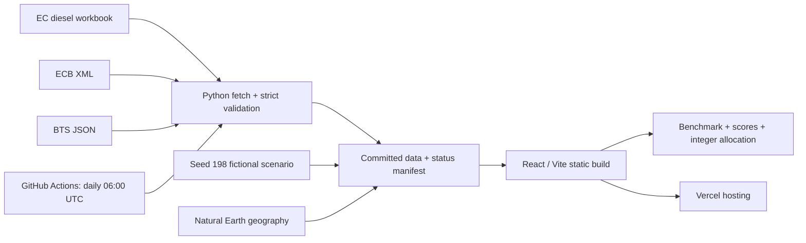

# Alpine Freight Cockpit

A European road-freight tender workbench that turns market signals and partner performance into an explainable shipping plan. Built as an independent portfolio for a Global Logistics role: compare bids, see which partners deliver, and balance price, reliability and capacity. A white stakeholder interface uses authentic Red Bull and publisher artwork, plain-language recommendations, adjustable priorities, and source details behind every real figure.


## Explore the cockpit

- **Overview:** annual scenario spend, savings opportunity, geographic network and next decisions.
- **Market Pulse:** published EU diesel, ECB currencies, U.S. freight context and honest carrier-source availability.
- **Tender Benchmark:** filter lanes and partners, inspect each calculation, export CSV.
- **3PL Scorecard:** compare service, choose Balanced / Service first / Cost first, or adjust priorities.
- **Volume Allocation:** change demand and service requirements; solve whole-load capacity and share constraints in the browser.
- **Methodology:** formulas, source register, assumptions and limitations.

See [all six desktop and phone screenshots](docs/verification/report.md).

## Run locally

Requires Node.js 22 and Python 3.11 or 3.12. Direct dependencies are pinned in the package and requirements files; npm installs from the committed lockfile.

```sh
python -m venv .venv
# Windows: .venv\Scripts\activate
# macOS/Linux: source .venv/bin/activate
pip install -r requirements.txt
python -m pytest
python synthetic/generate.py
cd web
npm ci
npm run dev
```

The committed data makes the website usable without running the scraper. Vite prints the local preview address. `npm run build` copies the data and Markdown into the static build, checks TypeScript and creates `web/dist`.

```sh
# From the repository root:
python scraper/run.py             # Live approved publishers
python scraper/run.py --fixtures  # Captured responses; preserves original timestamps
# From web/:
npm run lint
npm run typecheck
npm test
npm run build
npm run test:browser              # Local preview must be running; uses installed Chrome
```

The browser suite checks every page at 1440px and 375px, filtering, source dialogs, allocation infeasibility, CSV downloads, score changes, theme persistence and error recovery. In GitHub Actions it installs Chromium and starts a production preview automatically.

## Architecture



`refresh-data.yml` runs daily at 06:00 UTC and on manual dispatch. It tests parsers, refreshes sources, preserves last-good files, commits changed data/status, and reports partial failures. The separate quality workflow checks Python 3.11, lint, types, analytics, production build and browser behavior. Configure repository variable `SCRAPER_CONTACT` with an appropriate contact address; otherwise the descriptive placeholder is used.

## What is real and what is synthetic?

| Real, attributed evidence | Synthetic scenario |
| --- | --- |
| EU retail diesel observations | Five fictional logistics partners |
| ECB reference rates | Forty fictional partner–lane bids |
| BTS Freight Transportation Services Index | Capacity, transit estimates and surcharge assumptions |
| Natural Earth boundaries and city coordinates | 26-week partner performance, 1,040 records |
| Original artwork from official organisation websites | Scores, benchmark references, demand, allocations and savings derived from the scenario |

Distances are computed straight-line approximations. The fair-rate model derives its base rate and fallback surcharge from synthetic bids, with real diesel adjustment. It is **not an independent market quote**. U.S. freight TSI is informational context, not a European road-price input. Every scenario result is visibly marked Synthetic.

## Source register

| Publisher | Verified source | Use |
| --- | --- | --- |
| European Commission | [Weekly Oil Bulletin](https://energy.ec.europa.eu/data-and-analysis/weekly-oil-bulletin_en) | Tax-inclusive diesel history |
| European Central Bank | [Daily FX XML](https://www.ecb.europa.eu/stats/eurofxref/eurofxref-daily.xml?cb2af92b4b962bb8feefc7c75f2213f4) | Reference currencies per EUR |
| U.S. BTS | [Official dataset](https://data.bts.gov/api/v3/views/bw6n-ddqk/query.json) | Monthly freight volume context |
| Natural Earth | [Public-domain terms](https://www.naturalearthdata.com/about/terms-of-use/) | Geography and coordinate-derived distances |

Full URLs, captured samples, timestamps, robots policies and reuse notes: [sources](docs/sources.md). All formulas and distributions: [methodology](docs/methodology.md). Original brand-asset provenance: [brand-assets.json](docs/brand-assets.json).

## Deployment

Deploy **the repository root**, not only `web/`, so the build can access `data/` and `docs/`. Root `vercel.json` sets the install command, build command and `web/dist` output. After signing into Vercel, run the verified CLI version:

```sh
npm exec --yes --package=vercel@59.25.4 -- vercel login
npm exec --yes --package=vercel@59.25.4 -- vercel --prod
```

Connect the GitHub repository in Vercel to redeploy committed daily data updates. A local build or a configured workflow is not proof of a completed hosted deployment; verified status is tracked in [the verification report](docs/verification/report.md).

## Known limits

- No working carrier surcharge HTML feed: DHL requests timed out; DSV republication permission is unresolved. The UI identifies the synthetic fallback. Actual carrier logos identify source publications only, never fictional performance.
- Rates and volumes are a demonstration, not operational recommendations or real Red Bull data.
- Annualisation repeats the weekly scenario for 52 weeks without seasonality.
- Automated accessibility checks are useful evidence, not a comprehensive WCAG certification.

Interview walkthrough: [60-second demo script](docs/demo-script.md).

Independent portfolio demo built by Mohammed Kaif Ahmed. Not affiliated with, endorsed by, or produced for Red Bull GmbH. Red Bull and the Red Bull logo are trademarks of Red Bull GmbH. All 3PL partners, bids, and performance data are synthetic.
