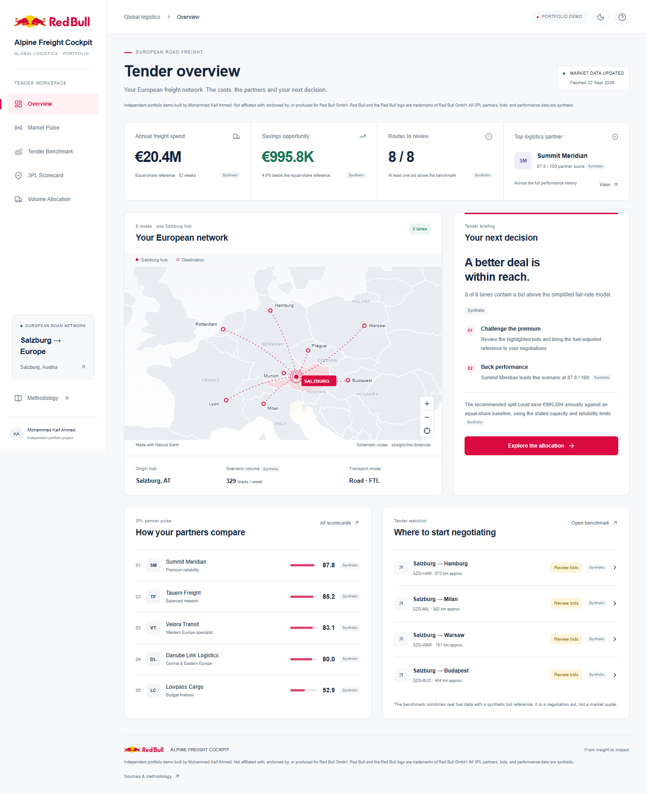
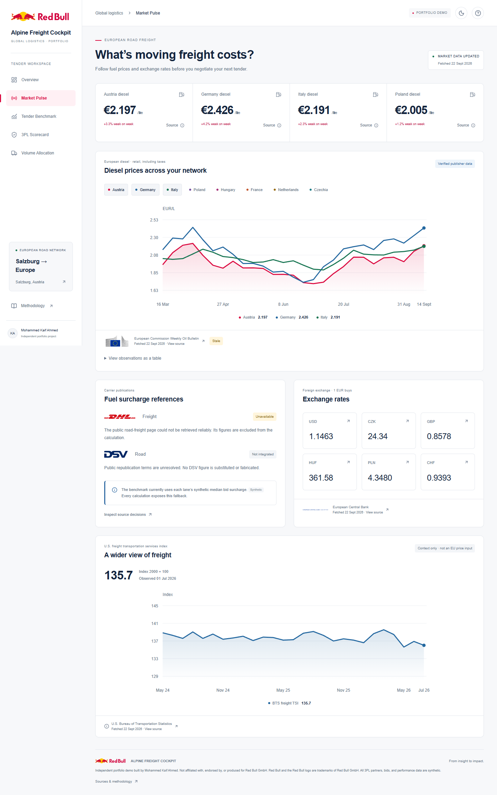
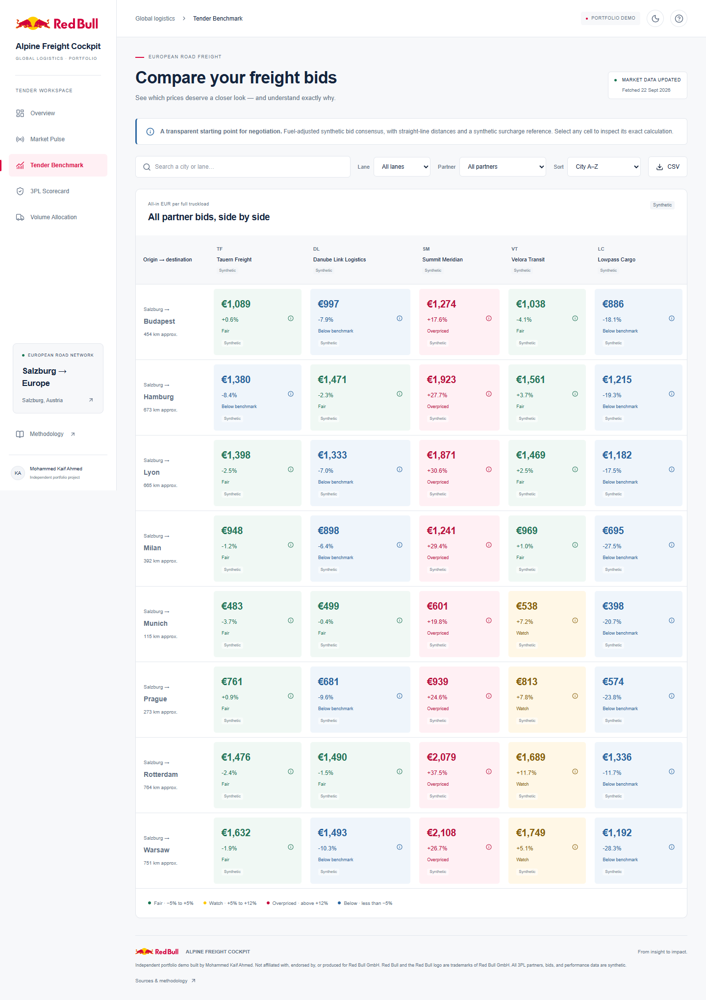
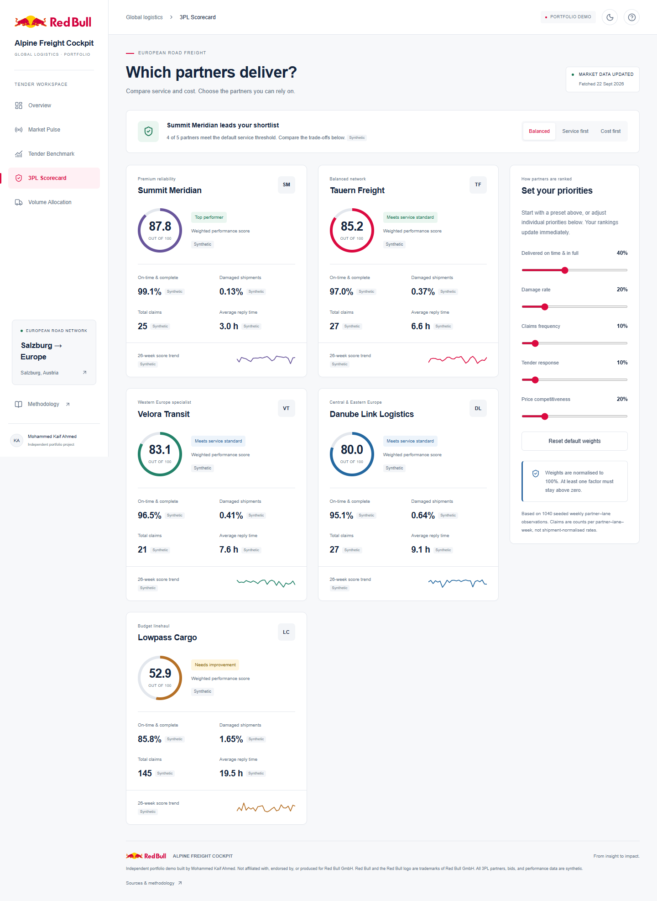
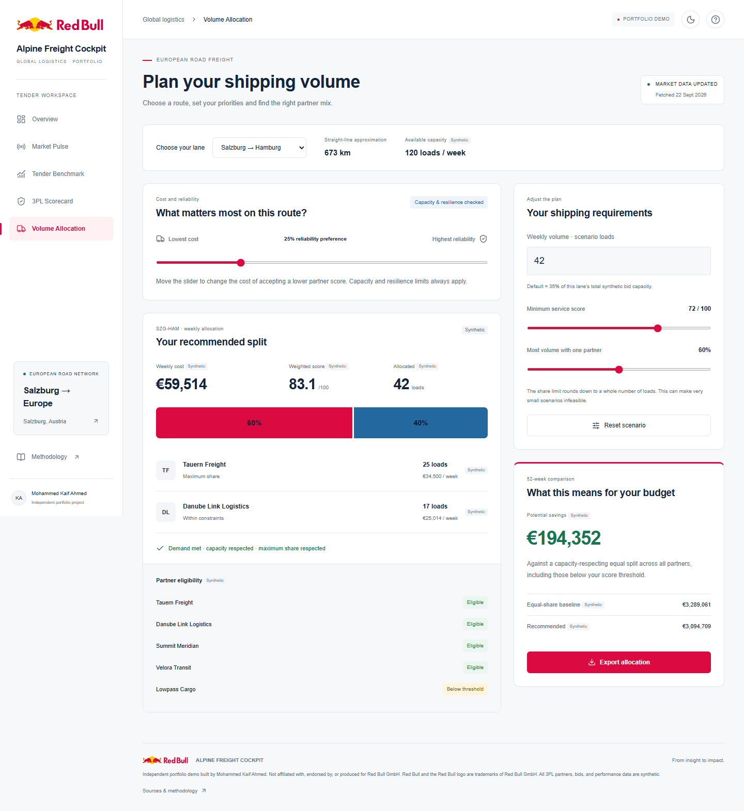
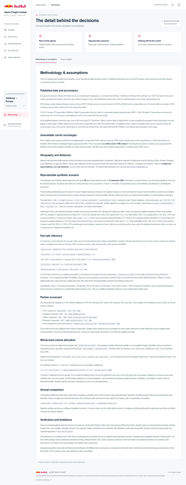

# Build and redesign verification

Verified locally on 24 September 2026 (Asia/Calcutta). The requested white redesign replaces the earlier dark draft: authentic Red Bull artwork, red navigation and primary actions, larger sentence-case typography, clearer partner comparisons, priority presets, mobile branding and source logos.

## Verified results

- Production build: passed, no TypeScript errors or build warnings. Full output in [build.txt](build.txt).
- Lint and typecheck: passed. Analytics: **20 passed**. Python parsers/contracts: **14 passed**. Actual output in [unit-checks.txt](unit-checks.txt).
- Production browser suite: **19 passed (29.6s)**. All six pages at 1440px and 375px; no document overflow or uncaught application errors. Checked filters, calculation details, CSV download, allocation response and infeasibility, weights, theme persistence, provenance, empty selection, failure recovery, mobile navigation and keyboard skip link. [Actual output](browser-tests.txt).
- Lighthouse on the local production Overview: **97 Performance / 100 Accessibility / 100 Best Practices**. Default mobile simulation; [raw audit](lighthouse-overview.json). These are measured local scores, not a guarantee of hosted performance or comprehensive accessibility certification.
- First live pipeline refresh: EC 216 records, ECB 29 records, BTS 27 records; all successful. Actual timestamps in [unit-checks.txt](unit-checks.txt). Failed-source preservation is covered by parser tests.
- Reproducible seed 198: five fictional partners, 40 bids, 1,040 weekly observations. Eight routes use actual Natural Earth city coordinates and clearly labelled great-circle distances.
- Authentic logo assets retrieved from official websites; original paths and colours retained. [Provenance](../brand-assets.json).

## Deployment and known limits

- Vercel CLI is signed out. A permanent production deployment has **not** been completed. The root Vercel configuration and static build are ready. No expiring temporary deployment was used.
- Daily refresh and CI workflows are committed in the project. Remote execution and scheduled delivery require a successful repository push and hosting connection; see the final delivery status below.
- Local Python was 3.12.14. CI explicitly targets the requested Python 3.11; local success is not presented as a completed remote CI run.
- Carrier HTML data is unavailable. DHL surcharge requests timed out; DSV republication permission remains unresolved. Carrier logos identify publications, not fictional performance. The benchmark discloses its synthetic surcharge fallback.
- Distances are straight-line approximations. Bid-derived benchmarks are simplified scenario references, not independent market quotes. The U.S. TSI is context only.
- Automatic approval review rejected uploading application source code to the external design service for the redesign. The visual redesign was completed locally; no workaround upload was attempted.

## Six-page screenshot gallery

Every image below is an unmodified browser capture of the implementation, not a design mockup.

### Overview

Desktop:

[Open the 375px phone capture](../screenshots/overview-375.png).

### Market Pulse

Desktop:

[Open the 375px phone capture](../screenshots/market-375.png).

### Tender Benchmark

Desktop:

[Open the 375px phone capture](../screenshots/benchmark-375.png).

### Partner performance

Desktop:

[Open the 375px phone capture](../screenshots/scorecard-375.png).

### Volume Allocation

Desktop:

[Open the 375px phone capture](../screenshots/allocation-375.png).

### Methodology

Desktop:

[Open the 375px phone capture](../screenshots/methodology-375.png).
